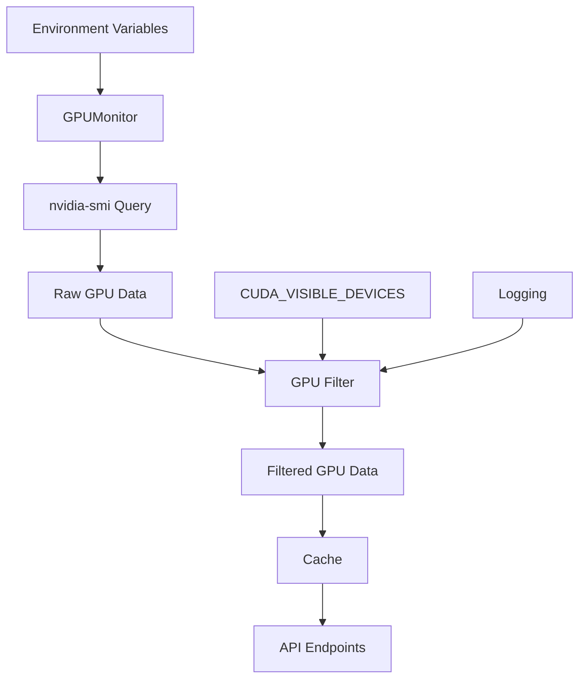

# Design Document

## Overview

This design implements CUDA_VISIBLE_DEVICES filtering for the GPU Statistics Server by adding a GPU filtering layer that processes nvidia-smi output to only include GPUs specified in the CUDA_VISIBLE_DEVICES environment variable. The filtering will be implemented as a post-processing step after nvidia-smi data collection, maintaining the existing caching and API structure while ensuring consistent filtering across all endpoints.

The design follows the principle of minimal disruption to existing functionality while adding robust filtering capabilities that handle edge cases and provide clear logging for debugging.

## Architecture

### High-Level Architecture



### Component Interaction

1. **Environment Loading**: CUDA_VISIBLE_DEVICES is loaded at server startup
2. **GPU Data Collection**: nvidia-smi is called to get all GPU information
3. **GPU Filtering**: Raw GPU data is filtered based on CUDA_VISIBLE_DEVICES
4. **Caching**: Filtered data is cached using existing caching mechanism
5. **API Response**: All endpoints return filtered data consistently

## Components and Interfaces

### 1. GPU Filter Component

**Location**: New methods in `GPUMonitor` class

**Interface**:
```python
class GPUMonitor:
    def __init__(self):
        self._visible_devices = self._parse_visible_devices()
        # ... existing initialization
    
    def _parse_visible_devices(self) -> Optional[List[int]]
    def _filter_gpu_data(self, gpu_data: Dict[str, Any]) -> Dict[str, Any]
    def _is_gpu_visible(self, gpu_id: int) -> bool
```

**Responsibilities**:
- Parse CUDA_VISIBLE_DEVICES environment variable
- Filter GPU data based on visible devices
- Handle invalid GPU indices gracefully
- Provide logging for debugging

### 2. Environment Variable Parser

**Implementation**: New method `_parse_visible_devices()`

**Input**: CUDA_VISIBLE_DEVICES environment variable string
**Output**: List of valid GPU indices or None (for all GPUs)

**Parsing Logic**:
- Support comma-separated format: "0,1,2"
- Support space-separated format: "0 1 2"
- Handle mixed separators and whitespace
- Validate GPU indices are numeric and non-negative
- Log warnings for invalid values

### 3. GPU Data Filter

**Implementation**: New method `_filter_gpu_data()`

**Input**: Raw GPU data from nvidia-smi
**Output**: Filtered GPU data containing only visible GPUs

**Filtering Logic**:
- Iterate through raw GPU list
- Include only GPUs whose IDs are in visible devices list
- Maintain original GPU IDs in filtered data
- Update gpu_count to reflect filtered count
- Preserve all other GPU metadata

### 4. Configuration Integration

**Enhancement**: Extend `/config` endpoint

**New Configuration Fields**:
```python
"gpu_filtering": {
    "cuda_visible_devices": CUDA_VISIBLE_DEVICES,
    "visible_gpu_ids": self._visible_devices,
    "filtering_active": self._visible_devices is not None
}
```

## Data Models

### Existing Models (No Changes Required)

All existing Pydantic models (`GPUInfo`, `GPUStats`, `GPUSummary`, etc.) remain unchanged. The filtering operates on the data before it's serialized into these models.

### Internal Data Structures

**Visible Devices Storage**:
```python
self._visible_devices: Optional[List[int]] = None  # None means all GPUs visible
```

**Filtered GPU Data Structure** (same as existing):
```python
{
    "gpu_count": int,  # Count of filtered GPUs
    "gpus": List[Dict],  # Only visible GPUs
    "timestamp": str
}
```

## Error Handling

### Invalid CUDA_VISIBLE_DEVICES Values

**Strategy**: Graceful degradation with logging

**Implementation**:
```python
def _parse_visible_devices(self) -> Optional[List[int]]:
    cuda_visible = os.getenv("CUDA_VISIBLE_DEVICES")
    if not cuda_visible:
        return None  # Show all GPUs
    
    if cuda_visible.strip() == "":
        return []  # Show no GPUs
    
    try:
        # Parse with multiple separator support
        devices = []
        for part in re.split(r'[,\s]+', cuda_visible.strip()):
            if part:
                device_id = int(part)
                if device_id >= 0:
                    devices.append(device_id)
                else:
                    logger.warning(f"Negative GPU ID {device_id} in CUDA_VISIBLE_DEVICES ignored")
        return devices
    except ValueError as e:
        logger.error(f"Invalid CUDA_VISIBLE_DEVICES format '{cuda_visible}': {e}")
        logger.info("Falling back to showing all GPUs")
        return None
```

### Non-existent GPU Indices

**Strategy**: Filter out invalid indices with warnings

**Implementation**:
```python
def _filter_gpu_data(self, gpu_data: Dict[str, Any]) -> Dict[str, Any]:
    if self._visible_devices is None:
        return gpu_data  # No filtering
    
    if "error" in gpu_data:
        return gpu_data  # Pass through errors
    
    available_gpu_ids = {gpu["gpu_id"] for gpu in gpu_data.get("gpus", [])}
    valid_visible_devices = []
    
    for device_id in self._visible_devices:
        if device_id in available_gpu_ids:
            valid_visible_devices.append(device_id)
        else:
            logger.warning(f"GPU {device_id} in CUDA_VISIBLE_DEVICES not found on system")
    
    # Filter GPUs
    filtered_gpus = [
        gpu for gpu in gpu_data.get("gpus", [])
        if gpu["gpu_id"] in valid_visible_devices
    ]
    
    return {
        "gpu_count": len(filtered_gpus),
        "gpus": filtered_gpus,
        "timestamp": gpu_data.get("timestamp")
    }
```

### Empty Visible Devices

**Strategy**: Return empty GPU list with clear messaging

**Behavior**: When CUDA_VISIBLE_DEVICES="" (empty string), return gpu_count=0 and empty gpus list

## Testing Strategy

### Unit Tests

**Test Categories**:

1. **Environment Variable Parsing**:
   - Valid comma-separated values: "0,1,2"
   - Valid space-separated values: "0 1 2"
   - Mixed separators: "0,1 2"
   - Empty string: ""
   - Invalid values: "abc", "-1", "0,abc,2"
   - Missing variable: None

2. **GPU Data Filtering**:
   - Filter with valid GPU IDs
   - Filter with non-existent GPU IDs
   - Filter with empty visible devices list
   - Filter with no filtering (None)
   - Filter with error responses from nvidia-smi

3. **API Endpoint Consistency**:
   - All endpoints return same filtered GPU set
   - GPU counts match across endpoints
   - Summary calculations use only filtered GPUs

### Integration Tests

**Test Scenarios**:

1. **End-to-End Filtering**:
   - Set CUDA_VISIBLE_DEVICES and verify API responses
   - Test with different GPU configurations
   - Verify caching works with filtering

2. **Error Handling**:
   - Invalid CUDA_VISIBLE_DEVICES values
   - Non-existent GPU references
   - Mixed valid/invalid GPU IDs

3. **Configuration Endpoint**:
   - Verify filtering configuration is reported correctly
   - Test with different CUDA_VISIBLE_DEVICES values

### Manual Testing

**Test Cases**:

1. **Container Environment**:
   - Deploy in Docker with CUDA_VISIBLE_DEVICES set
   - Verify only specified GPUs are visible

2. **Multi-GPU System**:
   - Test on system with 4+ GPUs
   - Set various CUDA_VISIBLE_DEVICES combinations
   - Verify correct filtering and calculations

## Implementation Plan

### Phase 1: Core Filtering Logic

1. Add `_parse_visible_devices()` method
2. Add `_filter_gpu_data()` method
3. Integrate filtering into `_fetch_gpu_stats()`
4. Add logging for debugging

### Phase 2: Configuration Integration

1. Update `/config` endpoint to include filtering info
2. Add startup logging for CUDA_VISIBLE_DEVICES
3. Enhance error messages

### Phase 3: Testing and Validation

1. Implement comprehensive unit tests
2. Add integration tests
3. Manual testing in various environments
4. Performance validation

### Phase 4: Documentation Updates

1. Update SERVER.md with filtering documentation
2. Update API.md with configuration changes
3. Add examples and troubleshooting guide

## Performance Considerations

### Caching Impact

**Analysis**: Filtering occurs after nvidia-smi call but before caching, so:
- Cache stores only filtered data (smaller memory footprint)
- No performance impact on cached requests
- nvidia-smi still called for all GPUs (necessary for accurate data)

### Memory Usage

**Impact**: Reduced memory usage due to smaller cached datasets when filtering is active

### CPU Overhead

**Analysis**: Minimal overhead from filtering logic:
- Simple list iteration and filtering
- Parsing CUDA_VISIBLE_DEVICES once at startup
- No impact on nvidia-smi call frequency

## Security Considerations

### Environment Variable Access

**Security**: CUDA_VISIBLE_DEVICES is read-only access to environment variables, no security risk

### GPU Information Exposure

**Benefit**: Filtering actually improves security by limiting GPU information exposure to only intended devices

### Input Validation

**Protection**: Robust parsing prevents injection attacks through malformed CUDA_VISIBLE_DEVICES values

## Backward Compatibility

### API Compatibility

**Guarantee**: All existing API endpoints maintain same response format and behavior when CUDA_VISIBLE_DEVICES is not set

### Configuration Compatibility

**Guarantee**: Existing configuration continues to work unchanged

### Client Compatibility

**Guarantee**: Existing clients continue to work without modification

## Monitoring and Observability

### Logging Enhancements

**Startup Logging**:
```
INFO: CUDA_VISIBLE_DEVICES: "0,2"
INFO: Visible GPU IDs: [0, 2]
INFO: GPU filtering active: 2 of 4 GPUs visible
```

**Runtime Logging**:
```
WARNING: GPU 3 in CUDA_VISIBLE_DEVICES not found on system
WARNING: Invalid GPU ID 'abc' in CUDA_VISIBLE_DEVICES ignored
```

### Configuration Endpoint

**New Fields**:
```json
{
  "gpu_filtering": {
    "cuda_visible_devices": "0,2",
    "visible_gpu_ids": [0, 2],
    "filtering_active": true,
    "total_system_gpus": 4,
    "visible_gpu_count": 2
  }
}
```

This design provides a robust, backward-compatible solution for GPU filtering that integrates seamlessly with the existing architecture while providing comprehensive error handling and debugging capabilities.