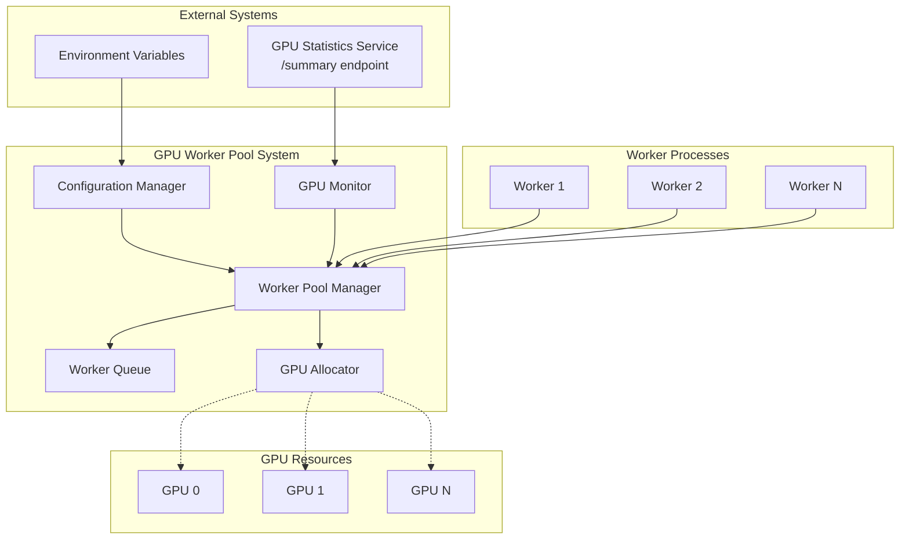

# Design Document

## Overview

The GPU Worker Pool system is designed as a resource management layer that sits between worker processes and GPU resources. It implements a polling-based monitoring system that continuously tracks GPU utilization through the existing /summary endpoint, and provides intelligent worker-to-GPU assignment based on configurable resource thresholds.

The system follows a producer-consumer pattern where GPU resources are the limited resource, workers are consumers, and the pool manager acts as the coordinator ensuring optimal resource allocation while preventing oversubscription.

## Architecture



## Components and Interfaces

### Configuration Manager
**Purpose:** Manages environment variable configuration and provides default values.

**Interface:**
```python
from abc import ABC, abstractmethod

class ConfigurationManager(ABC):
    @abstractmethod
    def get_memory_threshold(self) -> float:
        pass
    
    @abstractmethod
    def get_utilization_threshold(self) -> float:
        pass
    
    @abstractmethod
    def get_polling_interval(self) -> int:
        pass
    
    @abstractmethod
    def get_service_endpoint(self) -> str:
        pass
```

**Key Responsibilities:**
- Load and validate environment variables
- Provide fallback default values
- Handle configuration errors gracefully

### GPU Monitor
**Purpose:** Continuously polls the GPU statistics service and maintains current GPU state.

**Interface:**
```python
from abc import ABC, abstractmethod
from typing import Optional, List, Callable
from dataclasses import dataclass
from datetime import datetime

@dataclass
class GPUInfo:
    gpu_id: int
    name: str
    memory_usage_percent: float
    utilization_percent: float

@dataclass
class GPUStats:
    gpu_count: int
    total_memory_mb: int
    total_used_memory_mb: int
    average_utilization_percent: float
    gpus_summary: List[GPUInfo]
    total_memory_usage_percent: float
    timestamp: str

class GPUMonitor(ABC):
    @abstractmethod
    async def start(self) -> None:
        pass
    
    @abstractmethod
    async def stop(self) -> None:
        pass
    
    @abstractmethod
    def get_current_stats(self) -> Optional[GPUStats]:
        pass
    
    @abstractmethod
    def on_stats_update(self, callback: Callable[[GPUStats], None]) -> None:
        pass
```

**Key Responsibilities:**
- HTTP polling with configurable intervals
- Exponential backoff retry logic
- JSON response validation
- Event emission on stats updates

### GPU Allocator
**Purpose:** Determines GPU availability and makes assignment decisions based on resource thresholds.

**Interface:**
```python
from typing import Optional, Dict, List

class GPUAllocator(ABC):
    @abstractmethod
    def find_available_gpu(self, current_stats: GPUStats, assignments: Dict[int, List['WorkerInfo']]) -> Optional[int]:
        pass
    
    @abstractmethod
    def is_gpu_available(self, gpu: GPUInfo, assigned_workers: List['WorkerInfo']) -> bool:
        pass
    
    @abstractmethod
    def calculate_gpu_score(self, gpu: GPUInfo) -> float:
        pass
```

**Key Responsibilities:**
- Evaluate GPU availability against thresholds
- Implement GPU selection algorithm (lowest combined resource usage)
- Track current assignments per GPU

### Worker Queue
**Purpose:** Manages blocked workers and implements fair queuing for GPU assignment.

**Interface:**
```python
from typing import Optional, Callable
from dataclasses import dataclass
from datetime import datetime

@dataclass
class WorkerInfo:
    id: str
    enqueued_at: datetime
    callback: Callable[[int], None]
    on_error: Callable[[Exception], None]

class WorkerQueue(ABC):
    @abstractmethod
    def enqueue(self, worker: WorkerInfo) -> None:
        pass
    
    @abstractmethod
    def dequeue(self) -> Optional[WorkerInfo]:
        pass
    
    @abstractmethod
    def size(self) -> int:
        pass
    
    @abstractmethod
    def clear(self) -> None:
        pass
```

**Key Responsibilities:**
- FIFO queue implementation for blocked workers
- Worker callback management
- Queue size tracking and metrics

### Worker Pool Manager
**Purpose:** Main orchestrator that coordinates all components and provides the public API.

**Interface:**
```python
from typing import Dict, List
from dataclasses import dataclass
from datetime import datetime

@dataclass
class GPUAssignment:
    gpu_id: int
    worker_id: str
    assigned_at: datetime

@dataclass
class PoolStatus:
    total_gpus: int
    available_gpus: int
    active_workers: int
    blocked_workers: int
    gpu_assignments: Dict[int, List[WorkerInfo]]

class WorkerPoolManager(ABC):
    @abstractmethod
    async def request_gpu(self) -> GPUAssignment:
        pass
    
    @abstractmethod
    async def release_gpu(self, assignment: GPUAssignment) -> None:
        pass
    
    @abstractmethod
    def get_pool_status(self) -> PoolStatus:
        pass
    
    @abstractmethod
    async def start(self) -> None:
        pass
    
    @abstractmethod
    async def stop(self) -> None:
        pass
```

## Data Models

### GPU Resource State
```python
from typing import Optional, Dict, List
from datetime import datetime

class GPUResourceState:
    def __init__(self):
        self._gpu_stats: Optional[GPUStats] = None
        self._assignments: Dict[int, List[WorkerInfo]] = {}
        self._last_update: Optional[datetime] = None

    def update_stats(self, stats: GPUStats) -> None:
        pass
    
    def get_available_gpus(self) -> List[GPUInfo]:
        pass
    
    def get_assignments(self, gpu_id: int) -> List[WorkerInfo]:
        pass
    
    def add_assignment(self, gpu_id: int, worker: WorkerInfo) -> None:
        pass
    
    def remove_assignment(self, gpu_id: int, worker_id: str) -> bool:
        pass
```

### Worker Assignment Tracking
```python
from typing import Optional, Dict, List

class WorkerAssignmentTracker:
    def __init__(self):
        self._assignments: Dict[str, GPUAssignment] = {}
    
    def assign(self, worker_id: str, gpu_id: int) -> GPUAssignment:
        pass
    
    def release(self, worker_id: str) -> Optional[GPUAssignment]:
        pass
    
    def get_assignment(self, worker_id: str) -> Optional[GPUAssignment]:
        pass
    
    def get_all_assignments(self) -> List[GPUAssignment]:
        pass
```

## Error Handling

### GPU Service Connectivity
- **Connection failures:** Implement exponential backoff with maximum retry attempts
- **Timeout handling:** Configure reasonable timeout values with fallback behavior
- **Invalid responses:** Log errors and continue with last known good data
- **Service unavailable:** Gracefully degrade by blocking all new workers

### Worker Management
- **Worker timeout:** Implement worker heartbeat mechanism to detect stale assignments
- **Assignment failures:** Provide clear error messages and cleanup partial state
- **Queue overflow:** Implement maximum queue size with rejection policy
- **Resource cleanup:** Ensure proper cleanup on worker process termination

### Configuration Errors
- **Invalid thresholds:** Validate ranges (0-100%) and use defaults for invalid values
- **Missing environment variables:** Provide sensible defaults and log warnings
- **Service endpoint errors:** Validate URL format and connectivity on startup

## Testing Strategy

### Unit Testing
- **Configuration Manager:** Test environment variable parsing and default value handling
- **GPU Allocator:** Test threshold evaluation and GPU selection algorithms
- **Worker Queue:** Test FIFO behavior and queue operations
- **GPU Monitor:** Test polling logic and error handling with mocked HTTP responses

### Integration Testing
- **End-to-end worker assignment:** Test complete flow from worker request to GPU assignment
- **Resource threshold enforcement:** Verify workers are blocked when thresholds are exceeded
- **Service connectivity:** Test behavior with simulated service outages and recoveries
- **Concurrent worker handling:** Test multiple workers requesting GPUs simultaneously

### Performance Testing
- **High worker load:** Test system behavior with many concurrent worker requests
- **GPU resource exhaustion:** Verify proper blocking and unblocking behavior
- **Memory usage:** Monitor memory consumption under sustained load
- **Polling efficiency:** Measure impact of different polling intervals

### Error Scenario Testing
- **Service downtime:** Test graceful degradation when GPU service is unavailable
- **Invalid GPU data:** Test handling of malformed or unexpected response formats
- **Worker process crashes:** Test cleanup of assignments when workers terminate unexpectedly
- **Configuration changes:** Test behavior when environment variables change during runtime